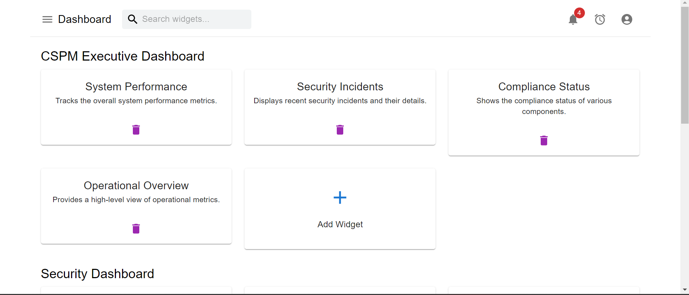
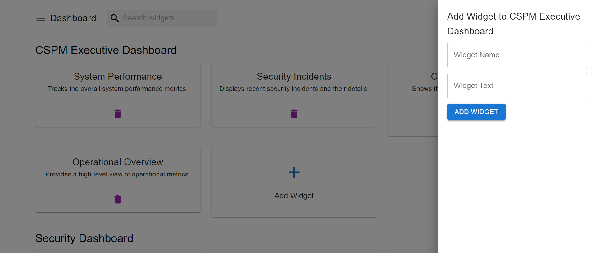
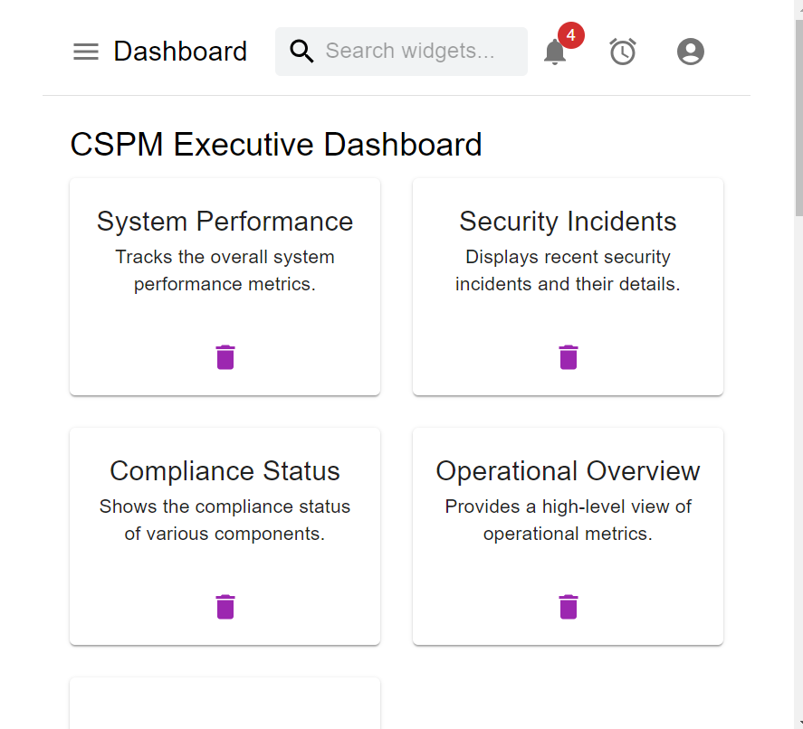

# Widget Dashboard

## Overview

Welcome to the Widget Dashboard project! This application provides a comprehensive dashboard where users can manage widgets across various categories. With functionalities like searching, adding, and deleting widgets, this app is built with modern web technologies.

### Install Dependencies

- npm install
- npm run dev (to start a frontend server)
- npm run server (to start a json/server)
## Technologies Used

- **Frontend:** React, Redux Toolkit, Material-UI
- **Backend:** JSON Server (running on port 3001)
- **Frontend Development Server Port:** 5173
- **State Management:** Redux Toolkit
- **Styling:** Material-UI

## Folder Structure

/widget-dashboard
- │
- ├── /public
- │ └── index.html
- │
- ├── /src
- │ ├── /components
- │ │ ├── AddWidgetDrawer.js
- │ │ ├── Body.js
- │ │ ├── CategoryComponent.js
- │ │ ├── Header.js
- │ │ ├── Holder.js
- │ │ └── WidgetCard.js
- │ │
- │ ├── /utils
- │ │ ├── bodySlice.js
- │ │ └── UsegetData.js
- │ │
- │ ├── App.js
- │ ├── index.js
- │ └── styles.css
- │
- ├── package.json
  └── README.md

## Getting Started

### Prerequisites

Make sure you have the following installed on your machine:

- Node.js and npm (Node Package Manager)

# Features
- Search Widgets: Filter widgets in real-time using the search bar.
- Add Widgets: Open a drawer to add new widgets to a category.
- Remove Widgets: Delete widgets from any category.
- Dynamic Updates: All changes are reflected immediately in the UI.
# State Management
- This application uses Redux Toolkit for state management. 
# Styling
- Material-UI is used for styling the components. It provides a set of React components that implement Google's Material Design.
# Performance Optimization
- To enhance performance and readability, this project utilizes custom components for:

    - Modular Design: Components are designed to be reusable and maintainable.
    - Performance Optimization: Custom components are optimized to avoid unnecessary re-renders and improve application responsiveness.
    - Readability: Code is organized in a way that improves readability and facilitates easier maintenance and updates.